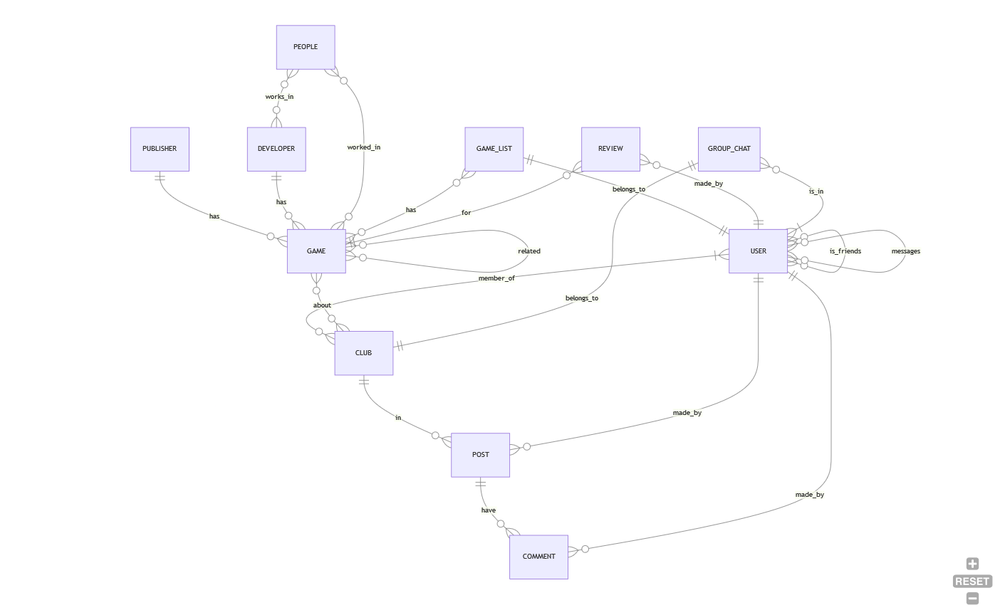

# Design Document

By Zafir Hossain Chowdhury.

Video overview: <URL HERE>

## Scope

This Database is decided for a webapp where users get info on video games and organize and score video games on a personal video game list. This also handles user-user interactions and social features like video game clubs.
This database was inspired by [My Anime List](https://myanimelist.net/), a website for organizing and scoring anime.
Similar websites exist that use a Database like this like [Backloggd](https://backloggd.com/). 
This is my interpretation of what database a “My Game List” website might use. 

Included in the databases scope is :
* Games include basic identifying information, release date, description, age rating, user rating(derived), alternative titles, genre,  cover photo, screenshots, promotional video, links to different store Pages(Steam, Epic, GOG) / Platform (PC, PS5, XBOX, Switch) and information on who made them. 
* Publishers include basic identifying information and information on if it is self published (Published by the developer) or not. 
* Developers (Studios/Teams)  include basic identifying information and information on the development studio. Like what kind of studio they are (AAA, AA or Indie) and how many developers they have.
* People (Individuals) (Dev, Composer, Director ect),  include basic identifying information, a description on them IE what are they best known for, history on their careers, a link to external resources related to them, what games they worked on, what they did on each project. 
* Users include basic identifying information for the database. It also includes stuff like username, email, password hash, location, about me and date of birth, links(Links to other store/gaming sites (Steam, Nintendo Network, PlayStation Network)  if I decide to use the database for a webapp.
* Reviews include basic identifying information, contents of the review and if the user recommended the game or not.
* Friends includes basic identifying information and the date they became friends.
* Messages are messages between users. They include basic identifying information, time the message was sent and the content of the massage. 
* A users per game status is the most important feature/table. It includes basic identifying information, what game a user is tracking (Playing, Completed, On Hold, Dropped, Plans to Play), rating given by the user and time spent on that game. 
* Clubs include basic identifying information, name, type(private/public) and what the club is about (topic, genre, game). 
* Club Post are posts made in clubs and they have basic identifying information and content of the post.
* Club Post Media are links to media that a user might want to include, it includes basic identifying information, the link to the media and type to indentify what kind of media it is.
* Post comments are comments on the club post they have basic identifying information and content of the comment.
* Club group chat include basic identifying information and messages sent in the chat.

Out of scope are elements are buying, selling games, multiple cover arts, user submitted games and posts outside of club posts.
Stuff like witch publisher ows witch devolopers and revenue of the games are also out of scope.

## Functional Requirements

* CRUD operations for all the tables.
* Database for "My Game List" website.
* Could be used as a standalone database but not intuitive as the main gole of the database is to show the users "My Game List".

## Representation

Entities are captured in SQLite tables with the following schema.

### Entities TODO
TODO - START 
In this section you should answer the following questions:

* Which entities will you choose to represent in your database?
* What attributes will those entities have?
* Why did you choose the types you did?
* Why did you choose the constraints you did?

### Table 

* `id` is a `int` . this is the `PK` 
* `thing` Thing discription

TODO : DO THE SAME FOR ALL TABLE 
TODO - END 

### Relationships

The below entity relationship diagram describes the relationships among the entities in the database.

 

As detailed by the diagram:

* A GAME must have a DEVELOPER and a PUBLISHER. DEVELOPER and PUBLISHER can have multiple games or no games at all.
* People work in DEVELOPER(development studio) associated to a GAME. Many people can work in a game. People can work in many games. A game can have multiple people working on it.
* A USER has only 1 GAME_LIST. A GAME_LIST belongs to only 1 USER.
* A GAME_LIST can have multiple GAME and a GAME can be in multiple GAME_LIST.
* A CLUB can have multiple USERS. A USER can be in multiple CLUBS.
* A CLUB can have only 1 GROUP_CHAT. All USERS in the CLUB is a part of the GROUP_CHAT.
* A CLUB can have multiple POST. A POST belongs to a single CLUB. A POST is made by a single USER for a CLUB. A USER can make multiple POST.
* A POST have multiple COMMENT. A COMMENT is made by a USER for a POST. A USER can make multiple COMMENTS.
* USER can be friends with another USER.
* USER can send message to another USER.

## Optimizations TODO

In this section you should answer the following questions:

* Which optimizations (e.g., indexes, views) did you create? Why?

## Limitations

In this section you should answer the following questions:

* As this database is inspired by MAL(My Anime List). In MAL you can set how many times you rewatched an anime and also have more  detailed ways to track anime. This Database is not that detailed. MAL Clubs has more stuff that is not represented in this database TLDR its a very simplified Database of what a MAL for video games(My Game List) would look like.

* A bit oversite at my part, games can have multiple studios working on it but my database dose not represent that. In this database a game can only have 1 stdio working on it.
